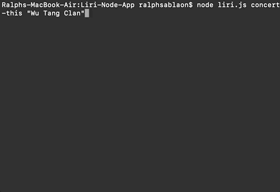

# Liri-Node-App

# Introduction
LIRI is like iPhone's SIRI. However, while SIRI is a Speech Interpretation and Recognition Interface, LIRI is a Language Interpretation and Recognition Interface. LIRI will be a command line node app that takes in parameters and gives you back data.

# What it does
The user has the option of using four commands (listed below) in conjuntion with specific parameters associated with the commands. The  `Commands` are:

   * `concert-this`

   * `spotify-this-song`

   * `movie-this`

   * `do-what-it-says`

- - -

## HOW TO USE LIRI
### **Video Guide**

### **Step by Step instructions**

1. Open your terminal such as Bash.
2. Navigate to the folder that contains the `liri.js` file. 
3. Depending on the command you run, the output will vary. 

    **Command 1**: Running the `concert-this` command
    
        node liri.js concert-this <name of artist or band>
    
    Result: The system will display a list of all events and locations where the artist or band will perform. It can result in multiple records.

    **Command 2**: Running the `spotify-this-song` command
    
        node liri.js spotify-this-song <name of song>
    
    Result: The system will display a list of information associated with the song. It can result in multiple records. 

    **Command 3**: Running the `movie-this` command
    
        node liri.js movie-this <name of movie>
    
    Result: The system will display information associated with the movie.

    **Command 4**: Running the `do-what-it-says` command
        
        node liri.js do-what-it-says
        
    Result: The system will read the text in the random.txt file, and perform the command in terminal. 

- - -

# Technologies Used

* JavaScript
* Node.js
* Node Packages:
    * Node-Spotify-API
    * Request
    * Moment
    * DotEnv
* APIs used:
    * Bands in Town
    * Spotify
    * OMDB

